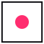
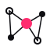

# bit — Brand

A visual identity for **bit**, a distributed Git implementation in MoonBit.

The brand exists to make three ideas legible at a glance:

> **a node, a source, a single bit of communication.**

---

## Concept

bit is distributed. Source is replicated. Peers communicate. The brand makes
this physical — a triad of geometric primitives, a pink node that always
represents *source*, an off-cream paper, an ink that is not quite black, and a
deliberately uncomfortable acid green held in reserve.

Three rules that never bend:

1. **No gradients.** Color is asserted, never blended.
2. **No shadows.** Depth comes from layout, not light.
3. **Geometric primitives only.** Circles, rectangles, lines. The wordmark is
   constructed from the same primitives as the logomark — they are literally
   the same alphabet.

---

## Logo

| Asset | File | Use |
| --- | --- | --- |
| Mark | [`logo/mark.svg`](logo/mark.svg) | App icon, avatar, square placements |
| Mark, inverse | [`logo/mark-inverse.svg`](logo/mark-inverse.svg) | Dark surfaces |
| Mark, mono | [`logo/mark-mono.svg`](logo/mark-mono.svg) | Single-channel printing, embossing |
| Wordmark | [`logo/wordmark.svg`](logo/wordmark.svg) | In-line product name |
| Wordmark, inverse | [`logo/wordmark-inverse.svg`](logo/wordmark-inverse.svg) | Dark surfaces |
| Lockup, horizontal | [`logo/lockup-horizontal.svg`](logo/lockup-horizontal.svg) | Header, README hero |
| Lockup, stacked | [`logo/lockup-stack.svg`](logo/lockup-stack.svg) | Square hero, cover art |

**Mark composition** — three nodes form an asymmetric triad:

- **pink filled** — *source*. The origin of truth.
- **ink outlined** — *peer*. A replica that has not converged.
- **ink filled** — *peer*. A replica that has.

Edges are thin. The triangle is intentionally non-equilateral. Symmetry is the
enemy of *distributed*.

**Wordmark construction** — `b`, `i`, `t` are rectangles and circles. The
tittle of the **i** is the pink dot. This is the brand's signature: a single
node, a single source, a single bit. Use it as a reductive brand mark on its
own where the full lockup would be too loud.

### Clear space

Minimum margin around any logo asset is **one source-node diameter** on every
side. The mark must never be cropped by a frame closer than this. When in
doubt, give it more room.

### Minimum size

- Mark: **24×24 px** on screen, **8 mm** in print.
- Wordmark: **80 px** wide on screen.
- Lockup: **160 px** wide on screen.

### Misuse

Do not stretch. Do not recolor (pink stays pink, ink stays ink). Do not add
strokes to the source node. Do not add a drop shadow. Do not place over a
photograph without a paper or ink rectangle behind it. Do not rotate beyond
the supplied compositions.

---

## Color

```
Bit Pink    #FF2D6F   Primary. Source, accent, the single bit.
Bit Ink     #0E0E12   Foreground. Off-black with a cool tint.
Bit Paper   #F2EFE7   Background. Warm cream.
Bit Stone   #D9D5CB   UI lines, dividers, secondary tracks.
Bit Acid    #D6FF3D   Eccentric counterpoint. Use SPARINGLY.
```

Press / hover states:

```
Pink Deep   #C7124F   Pressed pink only. Never as a primary surface.
Pink Tint   #FFD9E6   Chip/tag fill on paper.
```

**Rules.** Pink is a single state — owned by *source*, primary actions, and
the i-tittle. The acid green is permitted on one element per view and never
inside the logo. Ink is not `#000` and paper is not `#FFF` — the warmth in
paper and the coolness in ink are deliberate.

Full token sources: [`tokens/tokens.css`](tokens/tokens.css) ·
[`tokens/tokens.json`](tokens/tokens.json) (W3C draft format).

---

## Typography

| Role | Family | Loaded from |
| --- | --- | --- |
| Sans (display + body) | **Space Grotesk** — 300 / 400 / 500 / 600 / 700 | Google Fonts |
| Mono (machine voice, code) | **Space Mono** — 400 / 700 | Google Fonts |

**No italic. Anywhere.** Italic is forbidden in the brand — not in display,
not in body, not in code. Emphasis is carried by weight, color, and tracking.

### Scale

| Token | px | Use |
| --- | --: | --- |
| `--type-001` | 11 | micro label, system meta |
| `--type-00`  | 13 | caption |
| `--type-0`   | 15 | small body |
| `--type-1`   | 17 | body |
| `--type-2`   | 21 | lead paragraph |
| `--type-3`   | 28 | h4 |
| `--type-4`   | 40 | h3 |
| `--type-5`   | 60 | h2 |
| `--type-6`   | 96 | h1 |
| `--type-7`   | 148 | hero, poster |

### Tracking

- Display (≥ 60 px): **−0.035em** — tight, near-touching.
- Headings (28–60 px): **−0.018em**.
- Body: **0**.
- Labels (UPPERCASE, ≤ 13 px): **+0.16em**.

### Use it

- **Display headlines** in Space Grotesk **700** at `--type-5` or larger, tight
  tracking, leading `0.95`–`1.08`. Let one phrase fill a column. Generous
  whitespace below.
- **Body** in Space Grotesk **400** at `--type-1`, leading `1.55`.
- **Labels & meta** in Space Mono **400** UPPERCASE, `--type-001`,
  `tracking +0.16em` — used for `// COMMIT`, `NODE.0142`, kicker text, and
  data captions. This is where the eccentric mode-design voice lives.
- **Code** in Space Mono **400**, no italic. Comments in `--bit-ink-mute`.

Never pair these with Inter, Roboto, Helvetica, or system defaults. If a
target environment can only render system fonts, fall back to the platform
sans — never substitute a "near miss" web font.

---

## Iconography

Concept icons are 64×64, drawn with the same primitives as the logo. They are
not UI glyphs — they sit at section heads, in tables of contents, and on
covers.

| Icon | File | Concept |
| --- | --- | --- |
|  | [`icons/node.svg`](icons/node.svg) | A single addressable unit |
|  | [`icons/source.svg`](icons/source.svg) | Origin broadcasting to peers |
|  | [`icons/distributed.svg`](icons/distributed.svg) | A constellation, no single owner |
|  | [`icons/communication.svg`](icons/communication.svg) | An edge — one bit of exchange |

Drawing rules: 2 px stroke, square endpoints on rectangles, round caps on
lines, **one** pink element per icon, no gradient, no shadow, no perspective.

---

## Layout principles

- **Asymmetry over symmetry.** Compositions should feel like the triad mark —
  weighted, intentional, never centered for the sake of it.
- **Rules, not boxes.** Use a 1 px ink rule to divide content. Cards with
  rounded corners are forbidden; use rectangular ink-stroked panels with
  `radius: 0` and stroke `1.5px`.
- **Mono labels as kicker text.** A small Space Mono UPPERCASE label sits
  above every editorial heading, e.g. `// 003 — COMMUNICATION`.
- **One pink per view.** The primary action, or the source node, or the
  i-tittle in the wordmark — pick one anchor, not three.
- **Acid is a guest.** One acid element per page maximum. Often zero.

---

## Files

```
brand/
├── README.md                  ← you are here
├── tokens/
│   ├── tokens.css             ← CSS custom properties + @import for fonts
│   └── tokens.json            ← W3C-draft design tokens
├── logo/
│   ├── mark.svg
│   ├── mark-inverse.svg
│   ├── mark-mono.svg
│   ├── wordmark.svg
│   ├── wordmark-inverse.svg
│   ├── lockup-horizontal.svg
│   └── lockup-stack.svg
├── icons/
│   ├── node.svg
│   ├── source.svg
│   ├── distributed.svg
│   └── communication.svg
├── preview.html               ← visual showcase of the system
└── docs/
    └── docs-template.html     ← documentation page applying the brand
```

---

**License.** Brand assets are released under the project's Apache-2.0 license.
The MoonBit name and pink palette are referenced as cultural lineage, not
ownership.
